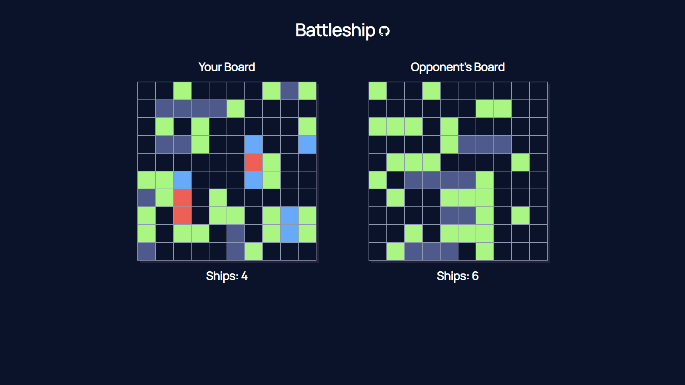

# Battleship

# Overview

[Live Site](https://purpleboxe.github.io/Battleship/)

## Preview

## The process

### Built with

- HTML5
- CSS
- JS
- Webpack
- Node
- ESLint

## Conclusion

This project was built for The Odin Project. This project was hard in the beginning for me but I eventually got the hang of it. I wanted to test out a linter so I decided to try out ESLint to make my code more readable. This project is my variation of the game Battleship created with Javascript, HTML, and CSS. I'm proud of what I made and if you decide to play it and test it out I want you to try and beat the computer. I have had a hard time beating the computer myself! Anyways have fun and thanks for checking out my project!